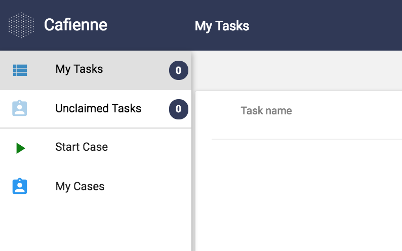

Cafienne UI consists of two types of user interfaces. First, there is the user interface “My Cases and Tasks” that give the user an overview of the cases he or she is involved with and tasks that are assigned to him or her or to open for a Case Role he or she fulfills. Next, there are Task UIs. Based on a JSON structure that reflects the Case File a simple React/Redux UI is generated. Using this UI a case worker can complete the task. The completion of the task is sent to the case engine, and next My Cases and Tasks will be updated.

## My Cases and Tasks
Cafienne UI comprises an user interface for MyTasks and My Cases. A case worker needs to be logged in to be able to use this user interface. In this UI a Case worker is given an overview of Tasks assigned to him or her. Next, there is a list of unclaimed Tasks that are assigned to a Role he or she fulfills; these tasks are available but not yet activated. Furthermore, there is a list of cases assigned to the user or the Case Team she or he participates in.



Also, we made it possible for a Case Worker to start a Case. The Start Case allows the user to sent a message to the Case Engine. This message starts the lifecycle of the Case, first of all by setting the state of the Case to Active.

## Task User Interfaces
We also added to Cafienne-demo “a method” that allows you to generate a Human Task interface, based on a JSON-file. This helps a lot in communication with business users or Case Workers. Next to validating the model, they can now  easily validate the way the work is organized by testing this by using “simple” UI with which they can complete their tasks. Completing a task will trigger the Case Engine, which will evaluate the state of the Case.

For instance, the JSON for starting the business application Hello World looks like:

```sh
{
  "schema":  {
    "title": "Greeting",
    "type": "object",
      "required": [
      "Greeting"
    ],
    "properties": {
      "Greeting": {
      "title": "Your greeting to the World",
      "type": "object",
        "properties": {
           "Message": {
              "type": "string",
              "title": "Your message"
            },
            "To": { 
              "type": "string",
              "title": "To whom?"
              },
            "From": {
              "type": "string",
              "title": "From",
              "default": "$CURRENT_USER"
              }
            }
          }
       }
     }
   }
```
If you want to learn more on how to use this method, go to [How to use task UI rendering](cafienneUIHTM.md).