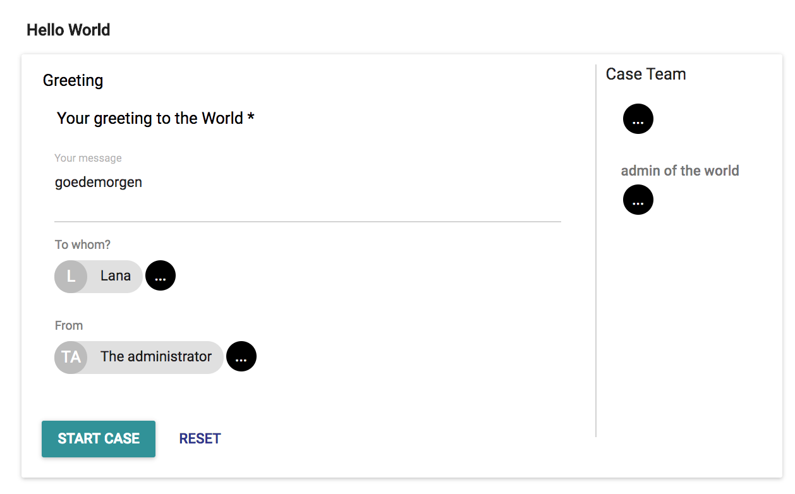
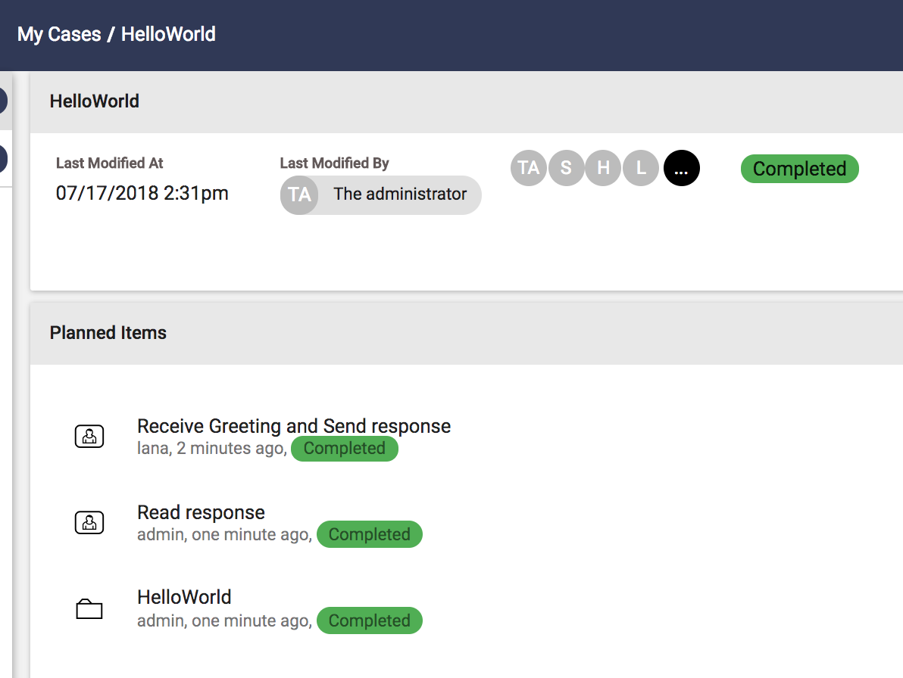

## HelloWorld
The first business application is called Hello World. A business user can sent a greeting to another business user using the following user interface that is based on the JSON shown in [Cafienne UI](CafienneUI.md).



In the UI above some user that is known as The administrator sends Lana the greeting “goedemorgen”. Lana can read this message once she has logged in into Cafienne UI. There she will see a Task “Receive Greeting and respond” assigned to her. She can now respond to The administrator. The administrator will receive the response and after that he or she can only complete the case. The myCases UI will show the following:



You can try it yourself once you obtained Cafienne-demo. Note that in Cafienne-demo there are four predefined user next to the administrator that you can use in this demo: Lana, Gerald, Hank and Suzy.

## Travel Request
Travel Request has a more elaborated case model. It supports a common procedure in many organizations: business travel. One of the team members needs to organize a trip to visit a client. They would have to fill in a form, email it to their supervisor, and get the approved form back from the supervisor. After the trip, they would need to fill in another form detailing travel expenses, submit this form for approval, and finally submit their approved expenses to accounting for reimbursement. This example relies heavily on the requester to manage the entire process by keeping track of where they are in the process and moving it along manually. 

> Note however, travel request is not so much a case and more like a business process. So, you can use Cafienne to build business processes also. 

Using Cafienne, you can break down this request into smaller processes: Requesting Travel, Approving Travel, and Submitting the Expenses, as shown in the model below.


We can make sure there are no more incomplete request forms by requiring specific information before it ever is submitted. We can define an approver role so that once the travel request is created, the appropriate supervisor is notified of the request. After approval, the process automatically moves onto the final step and lets the requestor know their request is approved. It assigns them a new task to submit their travel expenses after the trip.

The order of these tasks is important, and Cafienne manages the entire process. It delegates tasks to the correct team members since these roles can be clearly defined when designing the model. This removes the burden from the requester of figuring out who they should send a request to, remembering where they are in the process, and prevents them from sending it to the wrong team member.

> You can try it yourself once you obtained Cafienne-demo.

## Explaining the flow of the business apps

### Log in
So assume Hank want to sent a message to Lana. For that he can use the HelloWorld CasePlan in CafienneDemo. First of all, Hank needs to log in by using **post/identity/login**. There he needs to enter his credentials **{ "username": "hank", "password": "hank" }**. Hank should then have a response including a token. Because any other API-call needs that token in its header: X-AUTH-CAFIENNE. NOTE that this token can be found in the browser inspector but it should really be in the response.

### Start a case
Using post/cases Hank can start the Case. He authenticates him self using the X-AUTH-CAFIENNE and fills in the the body should like:

```sh
{  
  "definition":"HelloWorld.xml",
  "name":"HelloWorld",
  "inputs": {
    "Greeting": {
      "Message":"Hi",
      "To":"lana",       
      "From":"hank"       
      }    
   }
}
```
`post/cases` will respond with a message including the caseInstanceID and the name of the case:

```sh
{  
  "caseInstanceId": "2fdfba88_3331_4fe0_a3cf_83e4f6cc5b55",
  "name": "HelloWorld"
}
```
### MyCases
Hank can now see his Cases by calling on the method get/cases. He can also look at the case he just started calling get/cases/{caseInstanceID} using the parameters caseInstanceID and X-AUTH-CAFIENNE. Following is an excerpt of the response of the latter:

```sh
{
  "casefile": "..",    "lastModifiedBy": "hank",
  "definition": "HelloWorld",
  "planitems": [ 
    {
      "name": "HelloWorld",
      "currentState": "Active",
      "type": "CasePlan",
      ...
    },
    { 
      "name": "Receive Greeting and Send response",
      "type": "HumanTask",
      "transition": "Start",
      ... 
    },     
    {
      "name": "Read response",
      "currentState": "Available",
      "type": "HumanTask",
    } 
  }  
}
```
> You can read the it all using your browser inspector

Note that the engine returns a JSON in which all plan items and case file items are comprised. This case file, identified by a key, has a definition ‘HelloWorld” and is last modified by Hank. The case file compromises all the plan items of the case. The first plan item in the list is the Case itself, described with name “HelloWorld’ and type “CasePlan”. The two Human Tasks in the model are also loaded into the JSON of this Case Instance. The data on currentState, historyState, and transition reflect the lifecycle of each Plan Item. Publishing all modeled Plan Items in the Case Instance implicates that the Case Plan is immutable: the plan of the instance is not aware of later changes in the plan of the model.
Next to the Plan Items, the JSON comprises the team, which is not populated by Hank, a description of the attached casefile, and the file itself, which reflects the Case File Items and its properties.

### My Tasks
Next in the executing of the case, Lana should perform the human task Receive Greeting and Send Respond. Using the API, Lana must first login using post/identity/login. Next, she can retrieve all cases in which she is a team member and tasks that are assigned to her by calling on the API-method get/cases/user using X-AUTH-CAFIENNE that is in the response of the login. Then Lana can select a Task and execute it.

### Executing a task
Executing the task results in a call to the API-method POST/tasks/{taskId}/{transition}. The taskId is the ID-value in the JSON structure that refers to the Human Task Receive Greeting and Send Response. The transition is one of the actions that sets the state of the plan item lifecycle, default “complete”.


> See your browser inspector for this response

Now, Lana has sent in a transition in the life cycle of a plan item. Cafienne will evaluate this transition and accordingly set other plan item states to available, disabled, or completed.
