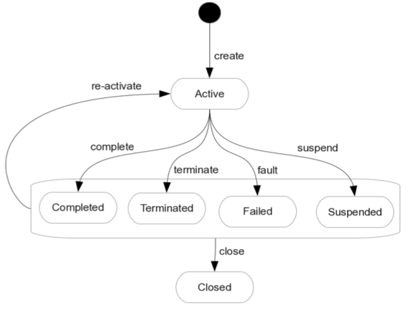
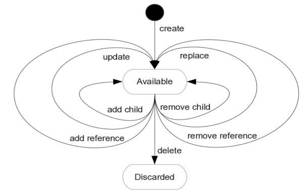

## Introducing the engine

A Case engine interprets the CMMN-model. The engine keeps track of what has been done in a Case, what is being done and suggests what can, should or must be done next. These “whats” make up everything that can be planned in the context of a Case, first of all Stages and Tasks.

Central to the case engine’s interpretation is the life cycle of the case itself and the life cycle of each plan item it contains. The life cycle start with the state “available”. Once the case or a task is available, a case worker can activate it. When the task is active, a case worker can start working on it. Working on the case can lead to different statuses such as completed, terminated, or suspended. When suspended, the case can be re-started. When completed or terminated, the case can be closed.

Also, the case engine interprets life cycle events of Case File Item. When a Case File Item is associated with a Human Task, the availability or the completeness of that task can be evaluated. A Case File Item can be associated with a Human Task using a Sentry. This Sentry allows us to describe whether a Task or Stage should be available (entry criterion, eg when a Case File Item is started) or can be completed (exit criterion, eg when the Case File Item is completed).

Also, a case worker can act as a case engine adding discretionary tasks to this lists of “things to be done”. A discretionary item is available to the case worker, to be applied in addition to his/her discretion. In this, it is opposed to planned items. 

Also, the case engine interprets some rules. In CMMN you can model repeatability and requiredness of human tasks and other Plan Items.  

Last, the engine will execute expressions. Expressions are linked to Sentries and operate over Case File Items in the Case File. In addition to Case File content, constant and time base expressions are also allowed. The expression language in Cafienne is Spring Expression Language (SpEL).

## Delving into the engine

Most of the execution semantics is desribed by the lifecycle for *plan items* and for *casefile items*. In addition, there are some behavioral rules. The engine also uses the logic provided by the Sentries.

### Case Lifecycle

The following diagram illustrates the lifecycle of a Case instance. Note that a Case can be active or closed and that intermediate states are completed, terminated, failed or suspended. These states are the results of transitions lik create, complete, re-activate or close.

### Plan item Lifecycle

The following diagram illustrates the lifecycel of a Stage or a Task instance. A Task or Stage can be Available, Enabled, Active, and Completed. A “sunny path”. They can also be Disabled (a case worker has decided the Stage or Task instance should not be executed), Failed (a software failure?!) or Suspended, or Terminated.

To go form one state to another state, a transition takes place. For example, the transition create will transition from “null” to Available, start from Available to Active.

As you will learn in Cafienne API, this “from-to” transition is in the response of API-calls that [retrieve information](apiRetrieving.md#a-case-instance) on plan item: historyState, CurrentState, transition.

### CaseFile item Lifecycle

The following diagram illustrates the lifecycle of a CaseFile item instance (see CMMN1.1). It has two states: Available and Discarded. These states can be reached the transitions create, update, replace and delete. In case, the CaseFile item is nested in another, the transitions possible are add or remove child.

Note that Cafienne as yet does not support references of CaseFile items.

In Cafienne, you can perform a transition on a CaseFile item by [completing a task](apiExecutingCase.md#planned-human-tasks) that has a CaseFile item in its output, or by performing a CaseFile item transaction [directly](apiCaseFile.md).

### Sentries

When multiple entry criteria (sentries) are used only one is required to trigger the transition out of Available state. The same is true for exit criteria. 

Entry criterion sentries are considered ready for evaluation while the task or stage (or milestone) is in Available state. Exit criterion sentries are considered ready for evaluation while the Case, Stage, or Task is in Active state.

Sentries are evaluated when events arrive to the system or when events are generated by the system. A single event may satisfy multiple sentries.

### Behavioral rules

The behaviral rules are:

* Required
* Repetition
* ManualActivition
* Applicability
* Stage.autocomplete

For a discussion, see section [Cafienne IDE](modelPlanItems.md#plan-item-properties).